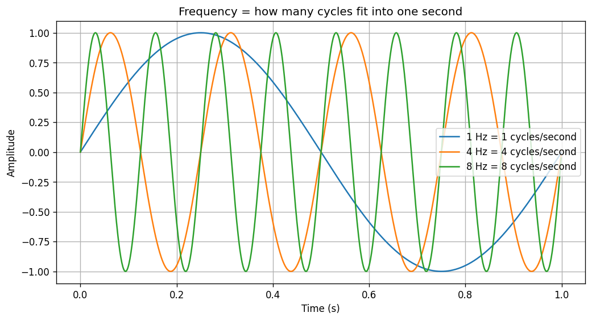
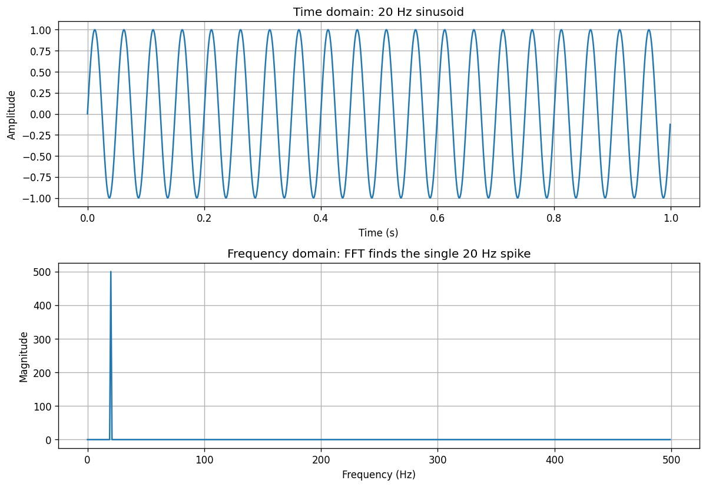
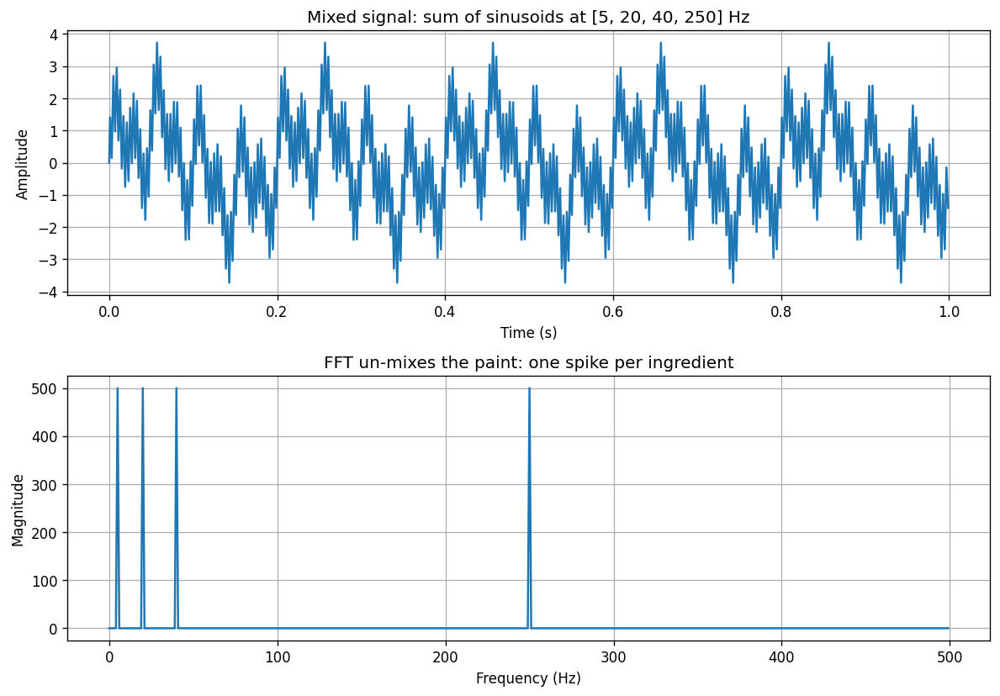
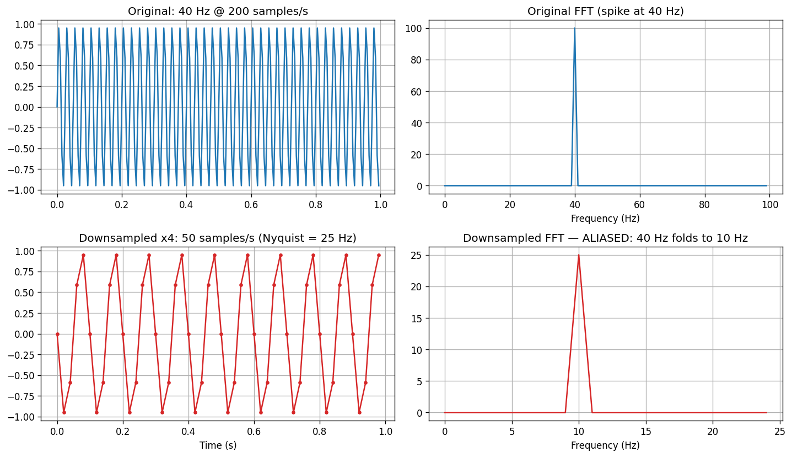
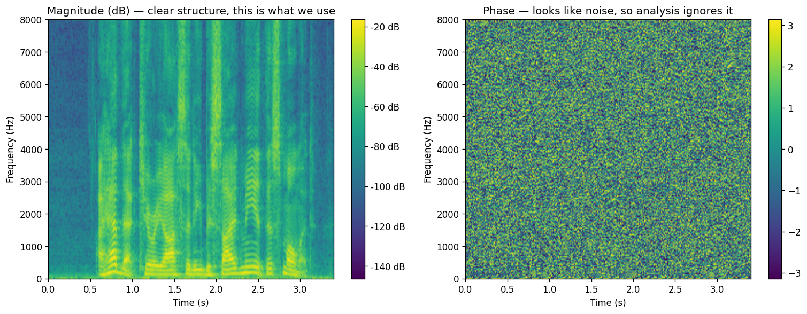
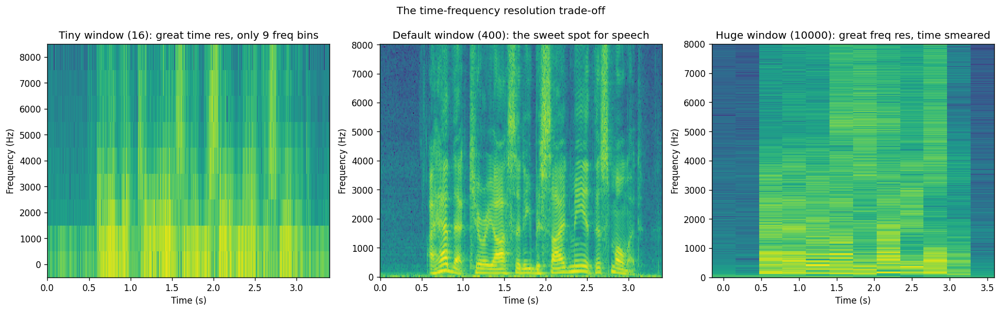
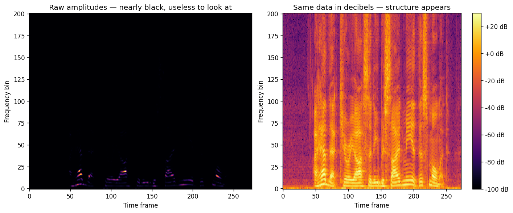
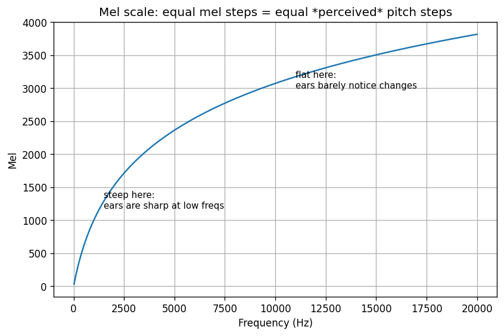
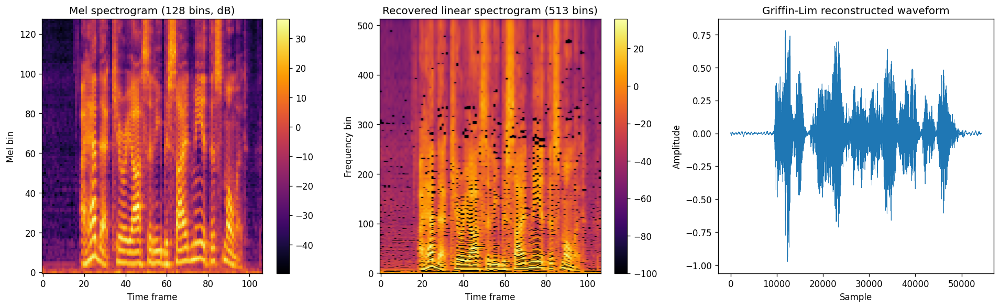

# Audio Signal Processing Fundamentals

Learner notes and hands-on code for the fundamentals of audio signal processing for deep learning — how raw audio becomes something a neural network can learn from, and how a model's output is turned back into sound you can hear.

Companion material for the video **[Intro to Audio Processing for Deep Learning](https://www.youtube.com/watch?v=55QWsm1itKo)**.

---

## Table of contents

- [Why this repository exists](#why-this-repository-exists)
- [The big picture: the audio-for-ML pipeline](#the-big-picture-the-audio-for-ml-pipeline)
- [Concepts covered (with the one-line intuition for each)](#concepts-covered-with-the-one-line-intuition-for-each)
- [Repository structure](#repository-structure)
- [Installation](#installation)
- [Quick start](#quick-start)
- [The four demos, in detail](#the-four-demos-in-detail)
- [The notebook](#the-notebook)
- [The notes](#the-notes)
- [Key formulas at a glance](#key-formulas-at-a-glance)
- [Parameter & keyword glossary (`n_fft`, `hop_length`, and more)](#parameter--keyword-glossary-n_fft-hop_length-and-more)
- [Standard parameter choices (and why)](#standard-parameter-choices-and-why)
- [Recommended learning path](#recommended-learning-path)
- [Troubleshooting](#troubleshooting)
- [Further learning](#further-learning)

---

## Why this repository exists

Neural networks don't eat `.flac` or `.mp3` files — they eat tensors. Between a recorded sound and a trainable tensor sits a chain of signal-processing steps that most ML tutorials skip over: sampling, the Fourier transform, spectrograms, mel scaling, and (for generative models) the reverse trip back to audio.

Skipping those steps has real consequences. The single most common silent bug in audio ML is **aliasing**: downsample a 24 kHz recording to the 16 kHz a model expects using naive slicing, and every frequency above 8 kHz doesn't just disappear — it *folds back* and corrupts the frequencies below it. Your data is damaged and nothing warns you.

This repository teaches the whole chain three ways at once:

1. **Read it** — deep-dive notes with analogies, formulas, and worked examples (`notes/`)
2. **Run it** — four standalone demo scripts that generate annotated plots (`src/`)
3. **Play with it** — an interactive notebook that follows the video (`notebooks/`)

---

## The big picture: the audio-for-ML pipeline

```text
                         FOURIER TRANSFORM (all time info lost -> rarely used alone)
                        ┌───────────────────────────► frequency domain
                        │
 WAVEFORM ──────────────┤
 (time domain,          │  STFT (window + overlap + FFT per chunk)
  raw samples)          └───────────────────────────► SPECTROGRAM  ("picture of audio")
                                                          │
                                                          │  mel filterbank (perceptual scale)
                                                          ▼
                                                     MEL SPECTROGRAM   ◄── what TTS models
                                                          │                predict, what ASR
        ┌─────────────────────────────────────────────────┘                models consume
        │  InverseMelScale (approximate! many-to-one binning)
        ▼
   LINEAR SPECTROGRAM (magnitude only — phase is missing)
        │
        │  Griffin-Lim (iterative phase recovery)   — or a neural vocoder (HiFi-GAN)
        ▼
   RECONSTRUCTED WAVEFORM  (≈ approximation of the original)
```

Models plug into this pipeline at two points:

| Entry point | Example models | Trade-off |
|---|---|---|
| **Raw waveform** | wav2vec 2.0 | No information loss, but long sequences and the model must learn frequency analysis itself |
| **(Mel) spectrogram** | Whisper, DeepSpeech 2, most TTS, HiFi-GAN | Compact, perceptually meaningful "image" input — but phase is discarded, so going back to audio needs a vocoder |

---

## Concepts covered (with the one-line intuition for each)

| Concept | One-line intuition | Where |
|---|---|---|
| **Waveform** | Audio is just a long list of air-pressure numbers over time | Notes §2, notebook cells 1–2 |
| **Sampling rate** | How many numbers the microphone records per second (property of the *recording*) | Notes §2, §4 |
| **Frequency (Hz)** | How many times the sound wave itself repeats per second (property of the *sound*) | Notes §3, Demo 1 |
| **Fourier transform** | Un-mixes a signal into the pure sine waves that were added together to make it — like un-mixing green paint back into blue and yellow | Notes §5, Demo 1 |
| **Magnitude vs phase** | Each FFT output is an arrow: length = how loud that frequency is, angle = where its cycle starts | Notes §6 |
| **Negative frequencies** | A bookkeeping mirror image; we always keep only the positive half (`n_fft // 2 + 1` bins) | Notes §7 |
| **Nyquist theorem** | A recording at *f*ₛ samples/s can only represent frequencies up to *f*ₛ/2 — you need ≥ 2 samples per cycle to see a wiggle | Notes §8, Demo 2 |
| **Aliasing** | Frequencies above the Nyquist limit fold back down and corrupt lower frequencies — the spinning-fan-in-a-video illusion | Notes §9, Demo 2 |
| **STFT / spectrogram** | FFT small overlapping chunks and stack the results into an image: time on x, frequency on y, loudness as color | Notes §13, Demo 3 |
| **Time–frequency trade-off** | Big window = sharp frequencies but blurry timing; small window = the reverse; you can't have both | Notes §14, Demo 3 |
| **dB scaling** | Audio energy spans millions-to-one ranges; log-scale it or your spectrogram (and your model) sees a black image | Notes §16, Demo 3 |
| **Mel scale** | Human pitch perception is logarithmic — 200→400 Hz sounds like a leap, 2500→2700 Hz barely registers — so we re-bin frequencies to match | Notes §17, Demo 4 |
| **Griffin-Lim** | Spectrograms lost the phase; recover a plausible one by bouncing between STFT and inverse STFT until overlapping windows agree | Notes §18, Demo 4 |
| **Neural vocoders** | Networks (HiFi-GAN) that *learn* the mel-to-waveform mapping and beat Griffin-Lim decisively | Notes §19 |

---

## Repository structure

```
├── notes/
│   ├── audio_processing_notes.md      # Detailed learner notes — 22 sections of deep-dive explanations
│   └── audio_processing_notes.html    # Same notes as a styled standalone web page (open in any browser)
├── notebooks/
│   └── intro_to_audio_processing.ipynb  # Follow-along notebook for the video (executed, outputs included)
├── src/
│   ├── signals.py                     # Shared helpers: sinusoid generation, positive-half FFT spectrum
│   ├── audio_io.py                    # Robust audio load/save via soundfile (no FFmpeg required)
│   ├── fourier_demo.py                # Demo 1: frequency basics, FFT of pure tones and mixtures, inverse FFT
│   ├── aliasing_demo.py               # Demo 2: Nyquist limit and aliasing, before/after FFT comparison
│   ├── spectrogram_demo.py            # Demo 3: STFT, magnitude vs phase, window-size trade-off, dB scaling
│   └── mel_reconstruction_demo.py     # Demo 4: mel scale curve, mel spectrogram, InverseMelScale + Griffin-Lim
├── scripts/
│   ├── download_sample_audio.py       # Fetches the 16 kHz speech sample the notebook/demos use
│   └── build_html_notes.py            # Regenerates the HTML notes from the markdown source
├── assets/                            # Committed copies of the demo plots (embedded in README + notes)
├── outputs/                           # Freshly generated plots + reconstructed audio (gitignored, created on demand)
├── requirements.txt
└── README.md
```

Design decisions worth knowing:

- **`src/` demos are standalone** — each maps to specific sections of the notes (referenced in its docstring), runs headless (`matplotlib` Agg backend), and writes numbered plots (`01_…` to `10_…`) to `outputs/` so you can study them side by side with the text.
- **`audio_io.py` avoids torchaudio file I/O on purpose.** torchaudio ≥ 2.9 delegates `load`/`save` to torchcodec, which requires system FFmpeg libraries. `soundfile` reads WAV/FLAC natively with zero system dependencies, so the code runs on a fresh machine. torchaudio is still used for what it's uniquely good at: `Spectrogram`, `MelSpectrogram`, `AmplitudeToDB`, `InverseMelScale`, `GriffinLim`, `Resample`.
- **The sample audio and fresh outputs are gitignored** — the repo stays small; one script regenerates everything. Reference copies of the ten plots live in `assets/` so the README and notes render with their graphs on GitHub without running anything.

---

## Installation

Requires **Python 3.10+**.

```bash
# (Recommended) create a virtual environment
python3 -m venv .venv && source .venv/bin/activate

# Install all dependencies
pip install -r requirements.txt

# Download the sample speech clip (3.4 s of clean speech, saved at 16 kHz
# as notebooks/sample_audio.flac — needed by the notebook and demos 3-4)
python scripts/download_sample_audio.py
```

What each dependency is for:

| Package | Used for |
|---|---|
| `numpy`, `scipy` | FFT (`np.fft`), STFT (`scipy.signal.stft`), signal generation |
| `matplotlib` | All plots |
| `torch`, `torchaudio` | Spectrogram / mel / dB / Griffin-Lim transforms, anti-aliased resampling |
| `soundfile` | Reading and writing WAV/FLAC without FFmpeg |
| `jupyter`, `ipython` | Running the notebook, in-notebook audio playback |
| `markdown` | `scripts/build_html_notes.py` (only needed if you rebuild the HTML notes) |
| `certifi` | SSL certificates for the sample-audio download on macOS |

---

## Quick start

```bash
# Run all four demos — each prints its findings and saves annotated plots to outputs/
python src/fourier_demo.py
python src/aliasing_demo.py
python src/spectrogram_demo.py
python src/mel_reconstruction_demo.py

# Or work through everything interactively
jupyter notebook notebooks/intro_to_audio_processing.ipynb
```

After Demo 4, listen to `outputs/reconstructed_griffin_lim.wav` next to `notebooks/sample_audio.flac` — the reconstruction is clearly intelligible but slightly robotic. That audible gap *is* the phase problem, and it's exactly why neural vocoders exist.

---

## The four demos, in detail

### Demo 1 — `src/fourier_demo.py`: frequency basics and the Fourier transform

*Notes sections 3, 5–7, 10, 11.*

| Output | What it shows |
|---|---|
| `01_sinusoid_basics.png` | 1 Hz / 4 Hz / 8 Hz sinusoids over one second — frequency is literally "how many cycles fit in a second" |
| `02_fft_pure_tone.png` | A 20 Hz tone in the time domain, and its FFT: a single clean spike at exactly 20 Hz |
| `03_fft_sum_of_sinusoids.png` | 5 + 20 + 40 + 250 Hz mixed into one messy wave; the FFT un-mixes it into four spikes — the "un-mixing paint" superpower |
| `04_inverse_fft.png` | FFT followed by inverse FFT reproduces the original signal to ~1e-15 error — the transform is a lossless *change of viewpoint*, not a compression |







**Key takeaway:** the Fourier transform answers "which pure frequencies, in which amounts, make up this signal?" — and it is perfectly reversible *as long as you keep the complex values (magnitude and phase)*.

### Demo 2 — `src/aliasing_demo.py`: Nyquist and aliasing

*Notes sections 8–9.*

A 40 Hz tone is sampled at 200 samples/s (Nyquist = 100 Hz, so it fits comfortably). Then it is downsampled **by naive slicing (`y[::k]`), deliberately without an anti-aliasing filter**, to expose the failure mode:

| Output | Downsample | New rate | New Nyquist | Result |
|---|---|---|---|---|
| `05_aliasing_downsample_x4.png` | ×4 | 50 samples/s | 25 Hz | **ALIASED** — the 40 Hz spike folds to \|50 − 40\| = **10 Hz**, a frequency that was never in the signal |
| `05_aliasing_downsample_x2.png` | ×2 | 100 samples/s | 50 Hz | Safe — the spike stays at 40 Hz |



**Key takeaway:** this is the exact trap from the video's real-world scenario — data recorded at 24 kHz with content up to 10 kHz, downsampled to 16 kHz for wav2vec 2.0: everything between the new 8 kHz Nyquist and 10 kHz folds back and corrupts the data. In real code, always resample with a filter: `torchaudio.transforms.Resample` (as `scripts/download_sample_audio.py` does).

### Demo 3 — `src/spectrogram_demo.py`: STFT, spectrograms, and the time–frequency trade-off

*Notes sections 12–16. Requires the sample audio.*

| Output | What it shows |
|---|---|
| `06_stft_magnitude_vs_phase.png` | The same STFT split into its two halves: the magnitude image has clear speech structure (harmonics, silences, consonant bursts); the phase image looks like pure noise — which is why analysis keeps only magnitude |
| `07_window_size_tradeoff.png` | The same audio with window sizes 16 / 400 / 10,000: tiny window = razor-sharp timing but only 9 frequency bins; huge window = beautiful frequency detail but time smeared; 400 = the speech sweet spot |
| `08_db_scaling.png` | Raw amplitudes (a nearly black, useless image) vs the same data in decibels (all structure visible) — why dB conversion is non-negotiable |

It also prints the spectrogram shape and explains it: `n_fft = 400` → **201 frequency bins** (`400 // 2 + 1`: positive frequencies + the 0 Hz DC term; the negative half is a redundant mirror).







**Key takeaway:** a spectrogram is a *picture of sound* built by FFT-ing small overlapping windows — and the window size is a genuine trade-off you tune per task, not a detail.

### Demo 4 — `src/mel_reconstruction_demo.py`: mel spectrograms and Griffin-Lim reconstruction

*Notes sections 17–19. Requires the sample audio.*

| Output | What it shows |
|---|---|
| `09_mel_scale_curve.png` | The Hz→mel curve: steep below ~1 kHz (ears are sharp there), flattening above (ears barely notice changes) — perception is logarithmic |
| `10_mel_and_reconstruction.png` | The 128-bin mel spectrogram, the 513-bin linear spectrogram recovered by `InverseMelScale`, and the waveform recovered by `GriffinLim` |
| `reconstructed_griffin_lim.wav` | The audible result — intelligible but robotic |





The reconstruction runs the exact inverse pipeline a classical TTS system would: **mel spectrogram → linear spectrogram → waveform**, and both steps are approximate for principled reasons:

1. **Mel → linear is lossy:** 513 linear bins were pooled into 128 mel bins (many-to-one), so un-pooling can't perfectly restore them.
2. **Phase is gone:** the spectrogram kept only magnitudes. Griffin-Lim recovers a *plausible* phase by iterating (100 iterations here): guess phases → inverse STFT → STFT → snap magnitudes back to the known target → repeat. It works because overlapping windows share samples, so their phases are constrained to be mutually consistent.

**Key takeaway:** you can hear exactly what "magnitude-only" costs — and why HiFi-GAN-style neural vocoders, which *learn* this inverse mapping, replaced Griffin-Lim in production TTS.

---

## The notebook

`notebooks/intro_to_audio_processing.ipynb` follows the video step by step: loading audio, plotting the waveform, sinusoids and the FFT, negative frequencies, Nyquist, the aliasing experiment, sum of sinusoids, the inverse transform, scipy and torchaudio spectrograms, dB conversion, mel spectrograms, and the full InverseMelScale + Griffin-Lim reconstruction with in-notebook audio playback so you can *hear* every result.

It has been executed end to end and ships with its outputs, so it's readable on GitHub without running anything. To re-run it, download the sample audio first (see [Installation](#installation)). The loading cell includes a `soundfile` fallback, so it works even where torchaudio's file I/O doesn't (see [Troubleshooting](#troubleshooting)).

---

## The notes

`notes/audio_processing_notes.md` (also as a styled standalone page: `notes/audio_processing_notes.html`) is the deep-dive companion — 22 sections that slow down exactly where the video speeds up:

- The **samples/second vs cycles/second** confusion, resolved with the spinning-fan analogy
- The FFT formula unpacked term by term — why multiplying by a "probe wave" and summing acts as a similarity test for each frequency
- Complex numbers as arrows: **magnitude = loudness, angle = phase**
- A worked **aliasing** scenario with the fold-back formula, plus the safe-resampling rule
- Spectrograms built up step by step, the **time–frequency uncertainty trade-off**, windowing (Hamming/Hann) and why overlap exists
- The **mel scale** derived from perception experiments (with the car-speed analogy for the power law of perception)
- **Griffin-Lim** explained as a constrained back-and-forth projection
- A **torchaudio cheat sheet**, six common pitfalls, self-test questions, and a full **parameter glossary** (`n_fft`, `hop_length`, `n_mels`, …)

Rebuild the HTML after editing the markdown with `python scripts/build_html_notes.py`.

---

## Key formulas at a glance

| Formula | Meaning |
|---|---|
| $y(t) = A \sin(2\pi f t + \varphi)$ | A sinusoid: amplitude $A$ (loudness), frequency $f$ (pitch), phase $\varphi$ (start offset) |
| $X[k] = \sum_{n=0}^{N-1} x[n]\, e^{-j2\pi kn/N}$ | Discrete Fourier Transform: similarity of the signal to a probe wave at each frequency $k$ |
| $f_{max} < f_s / 2$ | Nyquist: the highest frequency a recording at $f_s$ samples/s can represent |
| $f_{alias} = \lvert f - k f_s \rvert$ | Where an out-of-range frequency folds to after naive downsampling |
| bins $= n_{fft}/2 + 1$ | Frequency bins in a spectrogram: positive half + DC term |
| $\text{dB} = 20 \log_{10}(\text{amplitude})$ | Decibel scaling (log-compresses the huge energy range) |
| $m = 2595 \log_{10}(1 + f/700)$ | Hz → mel: equal mel steps ≈ equal *perceived* pitch steps |

---

## Parameter & keyword glossary (`n_fft`, `hop_length`, and more)

The full deep-dive with worked examples is in [`notes/audio_processing_notes.md` §23](notes/audio_processing_notes.md#23-parameter--keyword-glossary--what-n_fft-hop_length-etc-actually-mean). Here is the essential decoder:

### The names map to three questions

Every STFT/spectrogram parameter answers one of:

1. **How long is each slice of audio?** → `n_fft` (torchaudio) = `nperseg` (scipy)
2. **How far do you slide that slice?** → `hop_length` = `nperseg - noverlap`
3. **How many frequency rows come out?** → `n_fft // 2 + 1` linear bins, or `n_mels` after mel filtering

### `sample_rate` / `fs` / `sr`

Samples recorded **per second**. Not the pitch of the sound — it's a property of the **file**, not the wave.

- Window in seconds: `n_fft / sample_rate` (400 samples at 16 kHz = **25 ms**)
- Nyquist limit: `sample_rate / 2` (16 kHz → max **8 kHz** frequency)
- Models expect a fixed rate — always check and resample if needed

### `n_fft` — window size in samples

How many consecutive samples go into **one** FFT. This is the single knob that trades time precision against frequency precision.

| | Small `n_fft` (e.g. 16) | Large `n_fft` (e.g. 1024) |
|---|---|---|
| Window at 16 kHz | 1 ms | 64 ms |
| Frequency bins | 9 | 513 |
| Time resolution | sharp | blurry |
| Frequency resolution | coarse | fine |

**Common mistake:** expecting `n_fft` output bins. You get **`n_fft // 2 + 1`** (positive frequencies + DC). So `n_fft=400` → **201 rows**, not 400.

### `hop_length` — stride between windows

After FFT-ing one window, advance by this many samples before the next FFT.

- **Overlap** = `n_fft - hop_length`. Standard is 50%: `hop_length = n_fft // 2`.
- **Smaller hop** → more time columns → finer timing → bigger tensor.
- **Time frames** ≈ `num_samples / hop_length` (e.g. 54,400 samples / 512 hop ≈ **106 columns**).
- Must match between spectrogram creation and Griffin-Lim inversion.

### scipy equivalents

| scipy | torchaudio | Example |
|---|---|---|
| `nperseg=400` | `n_fft=400` | window length |
| `noverlap=200` | (derived) | overlap samples |
| — | `hop_length=200` | `nperseg - noverlap` |
| `fs=16000` | `sample_rate=16000` | samples per second |

### `n_mels` — mel frequency rows

How many perceptually spaced bins after pooling linear FFT bins. Standard: **128** for speech (also 80).

- Must satisfy: `n_mels ≤ n_fft // 2 + 1`
- Many linear bins merge into one mel bin → **lossy**, not perfectly invertible
- More mels = finer detail but larger input to the model

### `n_stft` — linear bin count for inverse mel

Always **`n_fft // 2 + 1`**. Tells `InverseMelScale` how wide the linear spectrogram should be. Must match the `n_fft` used in the forward `MelSpectrogram`.

### `mel_scale`

`"slaney"` or `"htk"` — two Hz→mel formulas. **Use the same one** for forward and inverse mel transforms.

### `n_iter` (Griffin-Lim)

How many phase-recovery loops. ~**100** for speech. More iterations = slightly better audio, diminishing returns after ~100.

### `orig_freq` / `new_freq` (Resample)

Old and new sampling rates for safe downsampling with an anti-aliasing filter — never just slice `audio[::2]`.

### `AmplitudeToDB`

Log-scales the spectrogram: `dB = 20 * log10(amplitude)`. Without it, plots and models see a nearly black image because loud peaks dominate the linear range.

### Traced example — every number in one pipeline

```python
T.MelSpectrogram(sample_rate=16000, n_fft=1024, hop_length=512, n_mels=128)(audio)
```

For ~3.4 s of audio at 16 kHz:

| What | Value |
|---|---|
| Each window | 1024 samples = **64 ms** of audio |
| Each hop | 512 samples = **32 ms** → 50% overlap |
| Internal linear bins | **513** (= 1024//2 + 1) |
| Output mel rows | **128** |
| Output time columns | **~106** (= ~54400 / 512) |
| **Output shape** | **(128, 106)** — mel bins × time frames |
| Max frequency | **8000 Hz** (Nyquist of 16 kHz) |

---

## Standard parameter choices (and why)

| Parameter | Typical value (16 kHz speech) | Why |
|---|---|---|
| Sampling rate | 16,000 Hz | Speech content lives below the 8 kHz Nyquist limit; standard for wav2vec 2.0, Whisper, etc. |
| `n_fft` (window) | 400 (25 ms) or 1024 | Long enough to resolve voice harmonics, short enough to track phonemes; 25 ms ≈ one quasi-stationary speech segment |
| `hop_length` | `n_fft / 2` (50% overlap) | Every sample sits at the center of some window; enables overlap-add inversion |
| `n_mels` | 128 (also 80) | Compresses 513 linear bins to a perceptually spaced set; must be ≤ `n_fft // 2 + 1` |
| Mel variant | `slaney` (or `htk`) | Two standard conventions — just be consistent between forward and inverse transforms |
| Griffin-Lim `n_iter` | ~100 | Enough iterations for the phase estimate to converge on short clips |
| Music sampling rate | 44,100 Hz | Full 20 kHz hearing range + safety buffer over the theoretical 40 kHz minimum |

---

## Recommended learning path

1. **Read the notes** ([`notes/audio_processing_notes.md`](notes/audio_processing_notes.md)) sections 1–7 with `src/fourier_demo.py` and its four plots open beside you.
2. **Do aliasing properly** — notes sections 8–9 with `src/aliasing_demo.py`. This is the concept practitioners most often get wrong; make sure you can predict the 10 Hz fold-back before running it.
3. **Spectrograms** — notes sections 12–16 with `src/spectrogram_demo.py`; stare at the window-size comparison until the trade-off feels obvious.
4. **Mel + reconstruction** — notes sections 17–19 with `src/mel_reconstruction_demo.py`; listen to the reconstructed audio.
5. **Work through the notebook** end to end while watching [the video](https://www.youtube.com/watch?v=55QWsm1itKo).
6. **Test yourself** with the self-check questions at the end of the notes (answers all derivable from the demos).
7. **Read the parameter glossary** — notes [§23](notes/audio_processing_notes.md#23-parameter--keyword-glossary--what-n_fft-hop_length-etc-actually-mean) or the [README glossary](#parameter--keyword-glossary-n_fft-hop_length-and-more) — whenever a keyword like `n_fft` or `hop_length` still feels opaque.

---

## Troubleshooting

**`torchaudio.load` fails with "TorchCodec is required" or FFmpeg errors.**
torchaudio ≥ 2.9 delegates file I/O to torchcodec, which needs system FFmpeg shared libraries. This repo sidesteps the issue everywhere: the demos use `src/audio_io.py` (soundfile-based) and the notebook's loader falls back to soundfile automatically. If you hit this in your own code, either `pip install torchcodec` + install FFmpeg, or load with `soundfile` and convert to a tensor.

**`ssl.SSLCertVerificationError` when downloading the sample audio (macOS).**
Python.org installs on macOS ship without system certificates. The download script already handles this via `certifi`; if you see it elsewhere, run `Install Certificates.command` from your Python folder or use a `certifi`-backed SSL context.

**Demos 3–4 exit with "Missing … sample_audio.flac".**
Run `python scripts/download_sample_audio.py` first — it downloads a public speech clip and saves it (properly resampled with an anti-aliasing filter) to `notebooks/sample_audio.flac`.

**The spectrogram plot is almost entirely black.**
You're looking at raw amplitudes. Convert to decibels first (`torchaudio.transforms.AmplitudeToDB`) — see `08_db_scaling.png` for the before/after.

---

## Further learning

- [3Blue1Brown — But what is the Fourier Transform?](https://youtu.be/spUNpyF58BY) — the essential visual intuition
- [Valerio Velardo — Audio Signal Processing for ML playlist](https://www.youtube.com/playlist?list=PL-wATfeyAMNqIee7cH3q1bh4QJFAaeNv0) — deeper theory with from-scratch implementations
- [torchaudio documentation](https://pytorch.org/audio/stable/index.html)
- Griffin & Lim (1984), *Signal Estimation from Modified Short-Time Fourier Transform*
- [HiFi-GAN paper](https://arxiv.org/abs/2010.05646) — the modern neural vocoder this material builds toward
