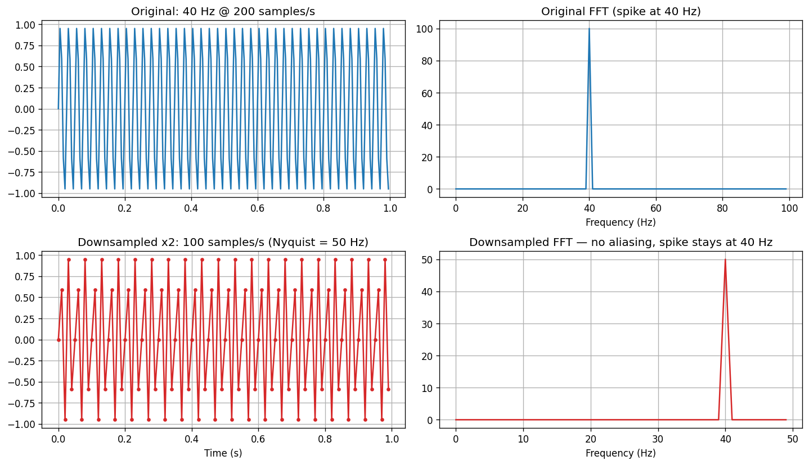
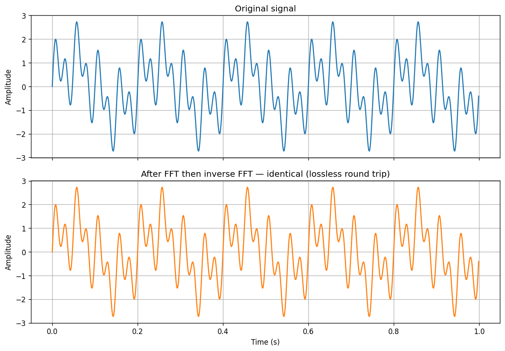

# Audio Signal Processing for Deep Learning — Detailed Learner Notes

> Companion notes for the video **[Intro to Audio Processing for Deep Learning](https://www.youtube.com/watch?v=55QWsm1itKo)** and the notebook `notebooks/intro_to_audio_processing.ipynb`.
> These notes go deeper than the video on the concepts that are usually hard the first time: **frequency, the Fourier transform, Nyquist/aliasing, spectrograms, the mel scale, and Griffin-Lim.**

---

## Table of Contents

1. [Why audio pre-processing matters](#1-why-audio-pre-processing-matters)
2. [Sound as data: waveforms and sampling rate](#2-sound-as-data-waveforms-and-sampling-rate)
3. [Frequency — the basics, the easy way](#3-frequency--the-basics-the-easy-way)
4. [Two different "per second" numbers (don't mix them up!)](#4-two-different-per-second-numbers-dont-mix-them-up)
5. [The Fourier Transform — intuition first](#5-the-fourier-transform--intuition-first)
6. [Reading the FFT output: complex numbers, magnitude, phase](#6-reading-the-fft-output-complex-numbers-magnitude-phase)
7. [Negative frequencies — why they appear, why we ignore them](#7-negative-frequencies--why-they-appear-why-we-ignore-them)
8. [The Nyquist–Shannon sampling theorem](#8-the-nyquistshannon-sampling-theorem)
9. [Aliasing — the downsampling trap (deep dive)](#9-aliasing--the-downsampling-trap-deep-dive)
10. [Sum of sinusoids: un-mixing the paint](#10-sum-of-sinusoids-un-mixing-the-paint)
11. [The Inverse Fourier Transform](#11-the-inverse-fourier-transform)
12. [Why the plain Fourier transform is not enough for speech](#12-why-the-plain-fourier-transform-is-not-enough-for-speech)
13. [The Short-Time Fourier Transform (STFT) and Spectrograms — the easy way](#13-the-short-time-fourier-transform-stft-and-spectrograms--the-easy-way)
14. [The time–frequency resolution trade-off](#14-the-timefrequency-resolution-trade-off)
15. [Windowing functions and overlap](#15-windowing-functions-and-overlap)
16. [Decibel (dB) scaling — why spectrograms look black without it](#16-decibel-db-scaling--why-spectrograms-look-black-without-it)
17. [The Mel scale and Mel spectrograms](#17-the-mel-scale-and-mel-spectrograms)
18. [Going backwards: the phase problem and Griffin-Lim](#18-going-backwards-the-phase-problem-and-griffin-lim)
19. [Neural vocoders](#19-neural-vocoders)
20. [The full pipeline — summary diagram](#20-the-full-pipeline--summary-diagram)
21. [torchaudio cheat sheet](#21-torchaudio-cheat-sheet)
22. [Common pitfalls and quick self-test](#22-common-pitfalls-and-quick-self-test)
23. [Parameter & keyword glossary — what `n_fft`, `hop_length`, etc. actually mean](#23-parameter--keyword-glossary--what-n_fft-hop_length-etc-actually-mean)

---

## 1. Why audio pre-processing matters

Neural networks do not eat `.flac` or `.mp3` files. They eat **tensors of numbers**. Everything in this lesson is about the pipeline that converts a recorded sound into a tensor a model can learn from — and (for generative models) how to convert the model's output back into sound you can hear.

There are two main ways audio is fed to modern models:

| Input type | Example models | What the model sees |
|---|---|---|
| **Raw waveform** | wav2vec 2.0 | A long 1-D array of amplitude samples |
| **(Mel) spectrogram** | Whisper, DeepSpeech 2, most TTS models, HiFi-GAN | A 2-D "image" of energy per frequency per time step |

To understand either path, you first need a handful of signal-processing ideas. That is what these notes are for.

---

## 2. Sound as data: waveforms and sampling rate

**Physically**, sound is a pressure wave in air. A microphone measures that air pressure thousands of times per second and stores each measurement as a number.

**Digitally**, an audio file is therefore just a **long list of numbers changing over time** — a time series:

```python
audio, sampling_rate = torchaudio.load("sample_audio.flac")
# audio  -> tensor([[ 0.0012, -0.0034, 0.0051, ...]])   the numbers
# sampling_rate -> 16000                                  how fast they were captured
```

Two properties describe every audio signal:

- **Sampling rate (samples/second, written Hz)** — how many measurements the microphone took each second. 16,000 Hz means 16,000 numbers per second of audio.
- **Duration** — number of samples ÷ sampling rate. An 8-second clip at 16 kHz has 128,000 samples.

Plotting the raw numbers against time gives the classic **waveform** — amplitude (air pressure) on the y-axis, time on the x-axis. This view is called the **time domain**.

**Typical sampling rates you will meet:**

| Sampling rate | Where you see it |
|---|---|
| 8,000 Hz | Telephone audio |
| 16,000 Hz | Most speech ML models (wav2vec 2.0, Whisper input) |
| 22,050 Hz | Many TTS datasets |
| 44,100 Hz | CD-quality music, most consumer microphones |
| 48,000 Hz | Video / professional audio |

---

## 3. Frequency — the basics, the easy way

**Frequency = how many times something repeats per second.** Its unit is **Hertz (Hz) = cycles per second**.

The simplest repeating signal is a **sinusoid** (a sine wave):

$$y(t) = A \sin(2\pi f t + \varphi)$$

Break the formula down — every symbol has an everyday meaning:

| Symbol | Name | Everyday meaning |
|---|---|---|
| \(A\) | Amplitude | How **loud** — the height of the wave |
| \(f\) | Frequency | How **high-pitched** — cycles completed per second |
| \(t\) | Time | Where we are on the clock |
| \(\varphi\) | Phase | Where in its cycle the wave **starts** (a left/right shift) |
| \(2\pi\) | — | One full circle in radians; \(2\pi f t\) means "complete \(f\) circles per second" |

Concrete examples:

- A **1 Hz** sine wave completes exactly **1 full up-down cycle** in one second.
- A **4 Hz** sine wave completes **4 cycles** in one second — it wiggles faster.
- A **440 Hz** sine wave is the musical note **A4** — the orchestra tuning note.

**Intuition ladder:**

- Low frequency → slow wiggle → **deep / bass** sound (a truck engine ~100 Hz)
- High frequency → fast wiggle → **sharp / treble** sound (a whistle ~2,000–4,000 Hz)
- Human hearing range: roughly **20 Hz to 20,000 Hz** (the upper limit drops with age)
- Human **speech** carries most of its useful information below ~8,000 Hz — this is exactly why speech models get away with 16 kHz sampling (see Nyquist, [section 8](#8-the-nyquistshannon-sampling-theorem)).

Here are 1 Hz / 4 Hz / 8 Hz sinusoids side by side (generated by `src/fourier_demo.py`) — count the cycles in one second:


---

## 4. Two different "per second" numbers (don't mix them up!)

This is the **single most common beginner confusion**, so it gets its own section.

| Concept | Unit | Question it answers | Belongs to |
|---|---|---|---|
| **Sampling rate** | samples/second | *How many numbers did the microphone record per second?* | The **recording** (the digital file) |
| **Frequency** | cycles/second (Hz) | *How many times does the sound wave itself repeat per second?* | The **sound** (the physical wave) |

Analogy: filming a spinning fan.

- The **fan's rotation speed** = frequency (property of the thing being observed).
- The **camera's frames per second** = sampling rate (property of the measurement).

If the camera films too slowly, the fan can look like it's spinning slowly, backwards, or standing still — that visual illusion **is literally aliasing**, the same phenomenon we will hit in [section 9](#9-aliasing--the-downsampling-trap-deep-dive).

The two numbers are linked by one rule — the **Nyquist theorem**: a recording at \(f_s\) samples/second can only faithfully contain frequencies up to \(f_s / 2\) cycles/second.

---

## 5. The Fourier Transform — intuition first

### The paint-mixing analogy

Mix blue paint and yellow paint → you get green. Looking at green paint, could you figure out which original colors went into it? With paint, no. With **sound, yes** — and the tool that does it is the **Fourier transform**.

> **The Fourier transform "un-mixes" a signal: it takes a complicated wave and tells you exactly which pure sine waves (which frequencies), in which amounts, were added together to produce it.**

Every sound — a voice, a chord, a dog bark — can be written as a **sum of plain sinusoids** at different frequencies, amplitudes, and phases. That is the deep claim behind Fourier analysis, and it's what makes all of audio ML possible.

### What it does, in plain words

- **Input:** the waveform — amplitude over **time** (time domain).
- **Output:** a list of "how much of each frequency is present" — energy over **frequency** (frequency domain).

If you feed it a pure 20 Hz sine wave, the output is (almost) all zeros with **one sharp spike at 20 Hz**. The transform found the ingredient:


### How does it actually find the frequencies? (gentle deep dive)

The formula for the Discrete Fourier Transform (DFT) is:

$$X[k] \;=\; \sum_{n=0}^{N-1} x[n]\; e^{-j 2\pi k n / N}$$

Don't panic — here is what it *means*:

1. \(e^{-j2\pi kn/N}\) is a **probe wave**: a spinning "reference sinusoid" at frequency \(k\) (Euler's formula says \(e^{j\theta} = \cos\theta + j\sin\theta\), so it packs a cosine and a sine into one object).
2. For each candidate frequency \(k\), we **multiply our signal by the probe wave and add everything up**.
3. If the signal **contains** frequency \(k\), signal and probe stay in step, the products reinforce each other, and the sum is **large** → big \(X[k]\).
4. If the signal **doesn't contain** frequency \(k\), the products oscillate between positive and negative and **cancel to ~zero** → tiny \(X[k]\).

So the Fourier transform is essentially a **similarity test against every possible frequency**: "Signal, how much do you resemble a 1 Hz wave? A 2 Hz wave? A 3 Hz wave? …" The answers, laid out on an axis, are the **spectrum**.

In code it's one line — the **FFT** (Fast Fourier Transform, just a fast algorithm for the DFT):

```python
y_fft = np.fft.fft(y)                    # the spectrum (complex numbers)
freqs = np.fft.fftfreq(len(t), d=t[1]-t[0])  # which frequency each entry corresponds to
```

> **Highly recommended:** the [3Blue1Brown video on the Fourier Transform](https://youtu.be/spUNpyF58BY) — the best visual explanation in existence.

---

## 6. Reading the FFT output: complex numbers, magnitude, phase

`np.fft.fft` returns **complex numbers** of the form \(a + bj\). Each one carries **two** pieces of information about one frequency:

| Quantity | Formula | Meaning | Do we usually use it? |
|---|---|---|---|
| **Magnitude** | \(\lvert X \rvert = \sqrt{a^2 + b^2}\) → `np.abs(X)` | **How much energy** (how loud) that frequency is | ✅ Almost always |
| **Phase** | \(\angle X = \arctan(b/a)\) → `np.angle(X)` | **Where in its cycle** that frequency starts (its time shift) | ⚠️ Ignored for analysis — but see [section 18](#18-going-backwards-the-phase-problem-and-griffin-lim)! |

Why complex numbers at all? A sinusoid ingredient needs both *"how strong"* **and** *"how shifted"* to be fully described. One complex number stores both compactly: its length is the strength, its angle is the shift.

**Mental model:** every frequency ingredient is an arrow. Arrow **length** = loudness of that frequency. Arrow **direction** = where that wave starts in its cycle. The FFT hands you one arrow per frequency.

When we "plot the FFT", we almost always plot `np.abs(y_fft)` — the **magnitude spectrum**. Throwing away phase is fine for *analysis* (what frequencies are present) but becomes a real problem for *reconstruction* (turning a spectrogram back into audio) — that's the Griffin-Lim story later.

---

## 7. Negative frequencies — why they appear, why we ignore them

Plot the raw FFT of a real signal and you'll see the spectrum is **mirrored**: a spike at +20 Hz and an identical one at −20 Hz.

**Why:** for any **real-valued** input (all audio is real-valued), the FFT output is *conjugate-symmetric* — every positive frequency comes paired with a negative twin carrying **exactly the same magnitude information**. It's a mathematical bookkeeping artifact of using complex exponentials to represent real waves: you need a "counter-spinning" partner so the imaginary parts cancel.

**Practical consequence:** the second half of the FFT output is redundant. We keep only the first half:

```python
half = len(freqs) // 2
plt.plot(freqs[:half], np.abs(y_fft)[:half])   # positive frequencies only
```

This is also why an STFT with `n_fft = 1024` gives **513 frequency bins**, not 1024: \(1024/2 = 512\) positive bins **+ 1** bin for the DC term (0 Hz, the constant offset). Remember `n_fft // 2 + 1` — it explains the shape of every spectrogram you'll ever print.

---

## 8. The Nyquist–Shannon sampling theorem

> **To faithfully capture a frequency of \(f_{max}\) cycles/second, you must sample at more than \(2 f_{max}\) samples/second.**

$$f_s > 2 \cdot f_{max} \qquad\Longleftrightarrow\qquad f_{max} < \frac{f_s}{2}$$

The value \(f_s/2\) is called the **Nyquist frequency** — the hard ceiling on what a recording can represent.

**Why factor 2 — the intuition:** to know a wave is wiggling, you must catch it at least once near a **peak** and once near a **trough** in every cycle — i.e., **at least 2 samples per cycle**. With fewer, you literally cannot tell how fast it was wiggling (the spinning-fan illusion).

**Worked examples:**

| Recording at… | Nyquist frequency (max representable) | Enough for… |
|---|---|---|
| 16,000 Hz | 8,000 Hz | Speech ✅ (speech lives mostly < 8 kHz) |
| 44,100 Hz | 22,050 Hz | Full human hearing (≤ 20 kHz) ✅ |
| 1,000 Hz | 500 Hz | Toy demo signals |

**Why 44,100 and not exactly 40,000?** Human hearing tops out around 20,000 Hz, so 40,000 samples/s is the *theoretical* minimum. Real-world hardware isn't perfect, so the industry standard adds a **safety buffer**: 44,100 Hz.

---

## 9. Aliasing — the downsampling trap (deep dive)

### What aliasing is

When a signal contains a frequency **above** the Nyquist limit of its sampling rate, that frequency doesn't just vanish. It **folds back ("aliases") into the representable range and shows up as a wrong, lower frequency.** The information is corrupted, not merely lost.

### The exact scenario from the video (memorize this reasoning)

You collected speech data and want to fine-tune wav2vec 2.0 (which expects 16 kHz audio):

1. Your data has real content up to **10,000 Hz**.
2. It was recorded at **24,000 samples/s** → Nyquist = 12,000 Hz → 10,000 Hz fits. ✅ All good.
3. The model needs **16,000 samples/s**, so you downsample 24k → 16k.
4. New Nyquist = **8,000 Hz**. But your data had content up to 10,000 Hz!
5. Everything between **8,000–10,000 Hz gets aliased** — folded down on top of legitimate lower frequencies, corrupting them. ❌

The image-world analogy: resizing an ImageNet image from 256×256 to 224×224 also throws away high-frequency detail — same math, we just rarely think about it for images.

### The notebook/`src/aliasing_demo.py` experiment

- Create a **40 Hz** sinusoid sampled at **200 samples/s** (Nyquist = 100 Hz → 40 fits fine; FFT shows a clean spike at 40 Hz).
- **Downsample by 4** (keep every 4th sample) → 50 samples/s → Nyquist = **25 Hz** < 40 Hz → the FFT spike moves to a **wrong, lower frequency**. The folded frequency lands at \(f_s - f = 50 - 40 = 10\) Hz. **That's aliasing.**


- **Downsample by 2** instead → 100 samples/s → Nyquist = 50 Hz > 40 Hz → the spike **stays at 40 Hz** (a bit less energy, but no corruption). ✅



### The fold-back formula

An input frequency \(f\) above Nyquist appears at:

$$f_{alias} = \lvert f - k \cdot f_s \rvert \quad \text{for the integer } k \text{ that brings it into } [0, f_s/2]$$

### How to downsample **safely**

Never just "take every Nth sample" on real audio. Proper resamplers **low-pass filter first** (removing everything above the new Nyquist), *then* decimate — so out-of-range content is deleted cleanly instead of folding back:

```python
resampler = torchaudio.transforms.Resample(orig_freq=24000, new_freq=16000)
audio_16k = resampler(audio_24k)   # anti-aliasing filter is built in
```

**Rule of thumb:** know the highest frequency that matters in your data, and never let the target sampling rate drop below twice that.

---

## 10. Sum of sinusoids: un-mixing the paint

The real magic: mix **several** sinusoids — say 5 Hz + 20 Hz + 40 Hz — into one messy-looking waveform. In the time domain it looks like noise-ish wiggles. Run the FFT:

**Three clean spikes: at 5 Hz, 20 Hz, and 40 Hz.** Add a 250 Hz component too → a fourth spike appears exactly at 250 Hz:


The Fourier transform perfectly un-mixed the recipe. This is precisely what it does to real speech, where hundreds of frequency components (pitch, harmonics, consonant noise, room reverb…) mix together in the air and in the microphone.

---

## 11. The Inverse Fourier Transform

The FT is a **lossless, reversible change of viewpoint** — like translating a book between two languages with zero information lost:

```python
y_fft = np.fft.fft(y)          # time domain  -> frequency domain
y_back = np.fft.ifft(y_fft)    # frequency domain -> time domain
# y_back ≈ y  (identical, up to floating-point dust)
```



**The crucial fine print:** perfect inversion needs the **full complex values** — magnitude **and** phase. Keep only magnitudes (as we do with spectrograms) and exact inversion becomes impossible. Pin this; it's the entire reason Griffin-Lim exists ([section 18](#18-going-backwards-the-phase-problem-and-griffin-lim)).

---

## 12. Why the plain Fourier transform is not enough for speech

Apply one big FFT to a whole 8-second sentence and you get… every frequency that occurred **anywhere** in the clip, all pooled together. You learn *what* frequencies existed but **not *when***. All temporal information is gone.

But speech **is** change over time — silence, then a vowel, then a hissy consonant, each with its own frequency fingerprint. A pure sine wave lives happily in the frequency domain because it never changes; speech doesn't.

| Representation | Time info | Frequency info |
|---|---|---|
| Waveform (time domain) | ✅ | ❌ |
| FFT of the whole clip (frequency domain) | ❌ | ✅ |
| **Spectrogram (STFT)** | ✅ | ✅ ← what we want |

The middle ground is the **Short-Time Fourier Transform**.

---

## 13. The Short-Time Fourier Transform (STFT) and Spectrograms — the easy way

### The idea in one sentence

> **Don't Fourier-transform the whole clip at once — slide a small window along the audio, FFT each little chunk, and stack the results side by side into an image.**

### Step by step

1. **Chop** the waveform into short chunks (e.g., 400 samples = 25 ms at 16 kHz). Chunk length = `n_fft` / `nperseg` (the *window size*).
2. **Overlap** consecutive chunks (typically 50%). The stride between chunk starts = `hop_length` (e.g., 200).
3. **Window** each chunk — multiply by a smooth bell-shaped curve (Hann/Hamming) so edges taper to zero ([section 15](#15-windowing-functions-and-overlap)).
4. **FFT each chunk** → one column of frequency energies for that moment in time.
5. **Stack columns** left to right → a 2-D array: the **spectrogram**.

> **Deep dive on every keyword:** see [§23 — Parameter & keyword glossary](#23-parameter--keyword-glossary--what-n_fft-hop_length-etc-actually-mean) for detailed explanations of `n_fft`, `hop_length`, `nperseg`, `noverlap`, `n_mels`, `n_stft`, and how they connect.

### How to read a spectrogram

A spectrogram is **a picture of sound**:

- **x-axis** = time
- **y-axis** = frequency (low at bottom, high at top)
- **color / brightness** = energy (how loud that frequency is at that moment)

Reading a speech spectrogram: silence shows as dark columns; vowels show as stacked horizontal bands (the harmonics of the voice); consonants like /s/ show as high-frequency noise splashes. The **shapes of the bands over time correspond to phonemes** — trained phoneticians can literally read words off a spectrogram.

```python
# scipy version (returns complex values -> both magnitude AND phase)
from scipy.signal import stft
f, t_spec, Zxx = stft(audio, fs=16000, nperseg=400, noverlap=200)
magnitude, phase = np.abs(Zxx), np.angle(Zxx)

# torchaudio version (returns magnitude/power spectrogram directly)
spec = torchaudio.transforms.Spectrogram(n_fft=400, hop_length=200)(audio)
```

Plot the **phase** image and you'll see what looks like pure noise — no visible structure. That's why everyone works with the magnitude spectrogram. (The phase still matters for *reconstruction* — [section 18](#18-going-backwards-the-phase-problem-and-griffin-lim).)


---

## 14. The time–frequency resolution trade-off

You cannot have perfect time resolution *and* perfect frequency resolution at once. (This is mathematically the same uncertainty principle as in quantum mechanics.)

| Window size | Time resolution | Frequency resolution | Spectrogram looks… |
|---|---|---|---|
| **Small** (e.g., 16 samples) | ✅ Excellent — you know exactly *when* | ❌ Terrible — only `16/2+1 = 9` frequency bins | Sharp horizontally, hopelessly coarse vertically |
| **Large** (e.g., 10,000 samples) | ❌ Terrible — each column covers a long stretch | ✅ Excellent — thousands of fine bins | Beautifully detailed vertically, smeared horizontally |
| **Medium** (e.g., 400–1024) | 👍 Good | 👍 Good | The sweet spot |

**Why, intuitively:** to *measure* a frequency you must watch the wave complete several cycles — a longer window sees more cycles, so it pins the frequency down precisely. But a longer window blurs *when* things happened, because everything inside one window collapses into one column. Short window = the reverse.

Here is the same speech clip at window sizes 16, 400, and 10,000 — watch the detail move between the axes:


**Practical defaults for 16 kHz speech:** `n_fft = 400` (25 ms) with `hop_length = 200` (later `1024 / 512` for mel spectrograms). These defaults are battle-tested; picking them is "a little bit of an art," but start here.

---

## 15. Windowing functions and overlap

**Problem:** chopping audio into chunks creates artificial cliff edges — the chunk starts and stops abruptly. The FFT interprets those clicks as fake high-frequency energy smeared across the spectrum (**spectral leakage**).

**Fix:** before FFT-ing, multiply each chunk by a **window function** — a smooth bump (Hann, Hamming, …) that is 1 in the middle and fades to ~0 at both ends. Edges get gently faded instead of chopped → much cleaner spectrum.

**But** fading the edges means the edges of each chunk are underrepresented. **Fix for the fix: overlap.** With 50% overlap, every sample sits at the *center* of some window even if it was at the *edge* of another. Example with window 20,000 / hop 10,000: chunks cover 0–20,000, then 10,000–30,000, then 20,000–40,000, …

Overlap also enables the **overlap-add** method used by the inverse STFT: overlapping regions must agree wherever windows overlap, which both makes reconstruction possible and provides the consistency constraint that Griffin-Lim exploits ([section 18](#18-going-backwards-the-phase-problem-and-griffin-lim)).

**Convention:** `hop_length = n_fft / 2` (50% overlap) is the standard default.

---

## 16. Decibel (dB) scaling — why spectrograms look black without it

Plot a raw spectrogram and you'll see a nearly black image with a few bright pixels. The reason: audio energy spans an **enormous range** — the loudest components can be millions of times stronger than the quietest ones, and a linear color scale spends all its colors on the top sliver.

Human loudness perception is **logarithmic** (like pitch — see mel, next section), so we log-scale energies into **decibels**:

$$\text{dB} = 20 \cdot \log_{10}(\text{amplitude}) \qquad \big(= 10 \cdot \log_{10}(\text{power}), \text{ since power} = \text{amplitude}^2\big)$$

```python
db_spec = torchaudio.transforms.AmplitudeToDB()(spec)
```

Handy facts: +6 dB ≈ double the amplitude; +20 dB = 10× the amplitude. After dB conversion, the spectrogram suddenly shows all its structure — harmonics, formants, noise floors. **Always convert to dB before visualizing or feeding spectrograms to a model.**


---

## 17. The Mel scale and Mel spectrograms

### Human pitch perception is not linear

Play 200 Hz → 400 Hz: sounds like a big jump. Play 2,500 Hz → 2,700 Hz (the **same** +200 Hz): barely noticeable. We hear **ratios**, not absolute differences — 200→400 doubled the frequency; 2500→2700 raised it only 8%.

Same as driving (the video's analogy): 10 → 20 mph feels dramatic (you doubled your speed); 60 → 70 mph feels like nothing, even though both are +10 mph. This "proportions, not absolutes" pattern is the **power law of perception** and applies to loudness, brightness, weight… and pitch.

### The mel scale

Researchers played tones to listeners, asked which pitch differences *felt* equal, and fit a curve to the data:

$$m = 2595 \cdot \log_{10}\!\left(1 + \frac{f}{700}\right) \qquad \big(\text{equivalently } 1127 \cdot \ln(1 + f/700)\big)$$

Properties of the curve:

- **Below ~1,000 Hz:** almost linear — small Hz changes are perceptually big, so they get lots of mel-space.
- **Above ~1,000 Hz:** logarithmic — huge Hz ranges compress into little mel-space, mirroring how indifferent our ears become up there.

Equal steps in **mel** ≈ equal steps in **perceived pitch**. (Two slightly different standard variants exist: **HTK** and **Slaney** — just be consistent; the notebook uses Slaney.)


### Mel spectrogram = spectrogram + mel-spaced frequency bins

Take the ordinary spectrogram, then pool its hundreds of linear frequency bins into a small number of **mel bins** (triangular overlapping filters): dense narrow bins at low frequencies (where our ears are sharp), wide sparse bins at high frequencies (where they're not).

```python
mel_transform = torchaudio.transforms.MelSpectrogram(
    sample_rate=16000,
    n_fft=1024,        # STFT window size
    hop_length=512,    # STFT stride
    n_mels=128,        # number of mel bins (128 is the speech-model standard)
    mel_scale="slaney",
)
mel_spec = mel_transform(audio)              # internally: STFT -> mel filterbank
mel_db  = torchaudio.transforms.AmplitudeToDB()(mel_spec)
```

**Constraints and consequences:**

- `n_mels` must be ≤ the number of FFT bins (`n_fft // 2 + 1`). With `n_fft=1024` you have 513 linear bins → 128 mels is comfortable.
- The mapping is **many-to-one** (several linear bins pour into one mel bin), so it is **not perfectly invertible** — information is genuinely discarded. This matters for reconstruction (next section).
- Why models love mel spectrograms: smaller input (128 rows instead of 513), and resolution is allocated where human-relevant information actually lives. The de-facto standard input for speech models.

---

## 18. Going backwards: the phase problem and Griffin-Lim

### Why we need to invert at all

A typical **text-to-speech** system doesn't generate waveforms directly — it generates a **mel spectrogram** (a much easier target to model), and then something must convert that picture back into actual audio.

### The two obstacles

1. **Mel → linear spectrogram is lossy.** Many linear bins were pooled into each mel bin; un-pooling can't perfectly restore them. `torchaudio.transforms.InverseMelScale` gives a good least-squares estimate.
2. **We only have magnitudes — the phase is gone.** The inverse STFT needs full complex values (magnitude **and** phase). Spectrograms kept only magnitude. Without phase, we don't know how the frequency components in each frame **align in time** with each other, and adjacent frames won't stitch together into a coherent waveform.

### The Griffin-Lim algorithm — phase by iteration

Griffin-Lim recovers a *plausible* phase by exploiting one constraint: because STFT windows **overlap**, neighboring frames share samples — so their phases can't be arbitrary; they must be **consistent** with a single underlying waveform.

The loop:

1. **Guess** random phases and attach them to the known magnitudes.
2. **Inverse STFT** → some waveform (initially garbage-ish).
3. **STFT that waveform** → its magnitudes have drifted from the target.
4. **Snap magnitudes back** to the known target values; keep the phases this round produced.
5. **Repeat** (e.g., 100 iterations). Each pass makes the phases more self-consistent; only consistent phases survive the round-trip.

It's a projection method: bounce between "waveforms with the right magnitudes" and "valid consistent STFTs" until they agree.

### Full reconstruction pipeline in torchaudio

```python
# mel spectrogram  ->  linear spectrogram  ->  waveform
inv_mel = torchaudio.transforms.InverseMelScale(
    n_stft=1024 // 2 + 1,   # 513 positive-frequency bins
    n_mels=128, sample_rate=16000, mel_scale="slaney",
)
griffin_lim = torchaudio.transforms.GriffinLim(
    n_fft=1024, hop_length=512, n_iter=100,
)
waveform_rec = griffin_lim(inv_mel(mel_spectrogram))
```

**Expected result:** clearly intelligible speech that sounds **slightly robotic/metallic**. Two error sources: the lossy mel→linear step, and Griffin-Lim's phase being an iterative approximation, never the true phase.


---

## 19. Neural vocoders

Griffin-Lim is the classical baseline, but modern systems use **neural vocoders** — networks trained to map mel spectrograms straight to waveforms:

- **HiFi-GAN** — fast GAN-based vocoder, near-human quality, the current workhorse.
- **WaveNet / WaveGlow / MelGAN** — earlier landmark designs.

Because a vocoder is *trained on real audio*, it **learns** what plausible phase (and the detail lost by mel binning) should look like, instead of solving for it iteratively. Result: dramatically more natural audio. Modern TTS = (text → mel spectrogram model) + (mel spectrogram → waveform vocoder).

---

## 20. The full pipeline — summary diagram

```text
                         FOURIER TRANSFORM (all time info lost -> rarely used alone)
                        ┌───────────────────────────► frequency domain
                        │
 WAVEFORM ──────────────┤
 (time domain,          │  STFT (window + overlap + FFT per chunk)
  raw samples)          └───────────────────────────► SPECTROGRAM  ("picture of audio")
                                                          │
                                                          │  mel filterbank (perceptual scale)
                                                          ▼
                                                     MEL SPECTROGRAM   ◄── what TTS models
                                                          │                predict, what ASR
        ┌─────────────────────────────────────────────────┘                models consume
        │  InverseMelScale (approximate! many-to-one binning)
        ▼
   LINEAR SPECTROGRAM (magnitude only — phase is missing)
        │
        │  Griffin-Lim (iterative phase recovery)   — or a neural vocoder (HiFi-GAN)
        ▼
   RECONSTRUCTED WAVEFORM  (≈ approximation of the original)
```

Two entry points for neural networks:

- **Raw waveform in** → wav2vec 2.0 and friends.
- **Spectrogram / mel spectrogram in** → DeepSpeech 2, Whisper, most TTS.

---

## 21. torchaudio cheat sheet

| Task | API |
|---|---|
| Load audio | `audio, sr = torchaudio.load("file.flac")` |
| Resample safely (anti-aliased) | `T.Resample(orig_freq, new_freq)` |
| Linear spectrogram | `T.Spectrogram(n_fft=400, hop_length=200)` |
| Mel spectrogram | `T.MelSpectrogram(sample_rate, n_fft, hop_length, n_mels, mel_scale)` |
| Amplitude → decibels | `T.AmplitudeToDB()` |
| Mel → linear spectrogram | `T.InverseMelScale(n_stft, n_mels, sample_rate, mel_scale)` |
| Magnitude spectrogram → waveform | `T.GriffinLim(n_fft, hop_length, n_iter)` |
| Play audio in a notebook | `IPython.display.Audio(waveform, rate=sr)` |

(`T` = `torchaudio.transforms`.) Numpy/scipy counterparts: `np.fft.fft`, `np.fft.ifft`, `np.fft.fftfreq`, `scipy.signal.stft`.

---

## 22. Common pitfalls and quick self-test

### Pitfalls

1. **Confusing samples/second with cycles/second.** The first describes the recording, the second the sound. ([Section 4](#4-two-different-per-second-numbers-dont-mix-them-up))
2. **Downsampling by slicing (`y[::4]`).** Causes aliasing. Use a proper resampler with an anti-aliasing filter.
3. **Forgetting dB conversion** before viewing/feeding spectrograms — you'll see (and the model will see) almost nothing.
4. **Expecting `n_fft` frequency bins.** You get `n_fft // 2 + 1` (positive frequencies + DC).
5. **Expecting mel → audio to be perfect.** Mel binning is many-to-one and phase is gone; reconstruction is inherently approximate.
6. **Assuming sampling rates match.** Always check the file's actual rate against what the model expects; resample if needed.

### Self-test (answers by working through the notebook)

1. An audio file has 32,000 samples and lasts 2 seconds. What is its sampling rate, and what is the highest frequency it can represent?
2. You slice-downsample a 60 Hz sinusoid recorded at 200 samples/s by a factor of 2. Does it alias? What about a factor of 4 — and at what frequency does the spike appear?
3. Why does an STFT with `n_fft=400` produce 201 frequency bins?
4. Give one reason to prefer a large STFT window and one to prefer a small one.
5. Why can't you run an inverse STFT directly on a magnitude spectrogram, and what property of overlapping windows lets Griffin-Lim work anyway?
6. Why do mel bins get wider as frequency increases?

---

## 23. Parameter & keyword glossary — what `n_fft`, `hop_length`, etc. actually mean

When you first open torchaudio or scipy code, you see a wall of short names: `n_fft`, `hop_length`, `n_mels`, `n_stft`, `nperseg`, `noverlap`. They are not arbitrary — each one controls **how long a slice of audio is**, **how far you slide that slice**, **how many frequency rows you get**, or **how the result is scaled**. This section is the decoder ring.

### Quick reference table

| Keyword | Library | What it counts | Typical speech value | Main effect |
|---|---|---|---|---|
| `sample_rate` / `fs` | both | samples per second of the audio file | 16,000 | Converts between sample indices and real time (seconds, Hz) |
| `n_fft` | torchaudio | samples in one STFT window | 400 or 1024 | Window length → frequency resolution + time smearing |
| `hop_length` | torchaudio | samples you advance between windows | 200 or 512 | Time step between spectrogram columns |
| `nperseg` | scipy STFT | same role as `n_fft` | 400 | Window length (scipy name) |
| `noverlap` | scipy STFT | overlapping samples between windows | 200 | Overlap = `nperseg - hop_length` |
| `n_stft` | torchaudio | number of **linear** frequency bins | 513 (= 1024//2+1) | Tells inverse transforms the spectrogram width |
| `n_mels` | torchaudio | number of **mel** frequency bins | 128 | Vertical size of a mel spectrogram |
| `mel_scale` | torchaudio | which Hz→mel formula | `"slaney"` or `"htk"` | Must match between forward and inverse mel |
| `n_iter` | GriffinLim | phase-recovery iterations | 100 | More = better (slower) reconstruction |
| `orig_freq` / `new_freq` | Resample | old and new sampling rates | 24000 → 16000 | Safe downsampling with anti-aliasing filter |

---

### `sample_rate` (also `sampling_rate`, `fs`, `sr`)

**Meaning:** how many amplitude numbers were recorded **per second** of real time.

**Units:** samples/second (written Hz, but this is *not* the pitch of the sound — see [section 4](#4-two-different-per-second-numbers-dont-mix-them-up)).

**Example:** at `sample_rate = 16000`, sample index 16,000 is exactly 1.0 second into the clip.

**Why it matters everywhere:**
- Converts window sizes from samples to milliseconds: `n_fft / sample_rate` seconds.
- Sets the Nyquist ceiling: max representable frequency = `sample_rate / 2`.
- Mel filterbanks and resamplers need it to place frequency bins on the correct Hz axis.
- Models are trained at a fixed rate — if your file is 44.1 kHz and the model expects 16 kHz, you must resample.

```python
duration_seconds = len(audio) / sample_rate
window_ms = n_fft / sample_rate * 1000        # e.g. 400 / 16000 = 25 ms
nyquist_hz = sample_rate / 2                  # e.g. 8000 Hz at 16 kHz
```

---

### `n_fft` — the STFT window size (in samples)

**Full name:** number of FFT points.

**Meaning:** how many consecutive audio samples go into **one** short-time Fourier transform. This is the length of each chunk before FFT.

**Not the same as:** the number of frequency bins in the output — you get **`n_fft // 2 + 1`** bins (positive frequencies + DC), not `n_fft`.

**What it controls:**

| Larger `n_fft` | Smaller `n_fft` |
|---|---|
| More frequency bins (finer pitch detail) | Fewer frequency bins |
| Each bin covers a narrower Hz band | Wider, blurrier frequency bands |
| Longer time window → worse *when* things happened | Shorter window → better time precision |
| Needs more samples to "see" low frequencies clearly | Can miss closely spaced harmonics |

**Intuition:** `n_fft` is how many samples you stare at before asking "what frequencies are in this little slice?" Stare longer → you resolve pitch better but lose track of timing.

**Worked example at 16 kHz:**

| `n_fft` | Window duration | Frequency bins | Bin spacing (approx.) |
|---|---|---|---|
| 400 | 25 ms | 201 | ~80 Hz per bin |
| 1024 | 64 ms | 513 | ~31 Hz per bin |
| 16 | 1 ms | 9 | very coarse |

```python
T.Spectrogram(n_fft=400, hop_length=200)(audio)
# output shape: (201, num_time_frames)  — NOT (400, ...)
```

**Rule of thumb for speech:** 400 (25 ms) for quick spectrograms; 1024 (64 ms) when building mel features for ASR/TTS — long enough to resolve harmonics, short enough that pitch doesn't change much inside one window.

---

### `hop_length` — the stride between windows

**Meaning:** after FFT-ing one window of `n_fft` samples, advance the window start by `hop_length` samples and FFT again. This is the **stride** or **hop** between consecutive STFT columns.

**Overlap:** when `hop_length < n_fft`, windows overlap. Overlap in samples:

$$\text{overlap} = n\_fft - hop\_length$$

**50% overlap (standard):** `hop_length = n_fft // 2`
- Window 1: samples 0 … 399
- Window 2: samples 200 … 599  (200 samples shared)
- Window 3: samples 400 … 799
- …

**What it controls:**
- **Smaller hop** → more time columns → finer time resolution → larger tensor → slower training.
- **Larger hop** → fewer columns → coarser timing → smaller tensor.

**Number of time frames (approx.):**

$$\text{num\_frames} \approx \left\lfloor \frac{\text{num\_samples}}{hop\_length} \right\rfloor$$

For our 3.4 s clip at 16 kHz (~54,400 samples) with `hop_length=200`: about **272 columns**. With `hop_length=512`: about **106 columns**.

**Why overlap exists:** window functions fade the edges of each chunk to zero. Without overlap, the faded edge samples would never be analyzed at full strength. 50% overlap ensures every sample sits near the **center** of some window where the window weight is strongest.

**Must match on inversion:** `GriffinLim` and inverse STFT need the **same** `n_fft` and `hop_length` used to create the spectrogram.

---

### `nperseg` and `noverlap` — scipy's names for the same thing

scipy uses different parameter names for the identical idea:

| scipy | torchaudio equivalent | Relationship |
|---|---|---|
| `nperseg` | `n_fft` | Length of each segment/window |
| `noverlap` | `n_fft - hop_length` | Samples shared between consecutive segments |
| `fs` | `sample_rate` | Sampling rate in Hz |

```python
# These two calls describe the same STFT settings:
scipy.signal.stft(audio, fs=16000, nperseg=400, noverlap=200)
T.Spectrogram(n_fft=400, hop_length=200)(audio)
# because hop_length = nperseg - noverlap = 400 - 200 = 200
```

---

### Frequency bins, `n_stft`, and the DC term

After an FFT of length `n_fft`, the output has `n_fft` complex numbers — but for **real** audio, half are redundant negative-frequency mirrors.

**What we keep:** `n_stft = n_fft // 2 + 1` bins:
- Bin 0 = **DC** (0 Hz) — the average offset of the signal, not a pitch.
- Bins 1 … `n_fft//2 - 1` = positive frequencies.
- Bin `n_fft//2` = **Nyquist frequency** = `sample_rate / 2` (only appears when `n_fft` is even).

**Example:** `n_fft=1024` → `n_stft = 513`. That is why mel spectrograms with `n_fft=1024` have a linear stage of width 513 before being compressed to 128 mel bins.

**Each bin's center frequency (approx.):**

$$f_k = k \times \frac{sample\_rate}{n\_fft} \quad \text{for bin index } k$$

So at 16 kHz with `n_fft=400`: bin 1 ≈ 40 Hz, bin 2 ≈ 80 Hz, …, bin 200 ≈ 8000 Hz (Nyquist).

---

### `n_mels` — number of mel filterbank bins

**Meaning:** how many **mel-spaced** frequency rows the mel spectrogram has after pooling the linear FFT bins.

**Not independent of `n_fft`:** you can only have as many mel bins as you have linear bins to pool from:

$$n\_mels \leq n\_fft // 2 + 1$$

**What it controls:**
- **More mels** (e.g. 128, 256) → finer perceptual frequency detail → taller tensor → more parameters for the model to process.
- **Fewer mels** (e.g. 40, 80) → stronger compression → smaller input → less detail, especially at high frequencies.

**Why 128 is standard:** 513 linear bins compressed to 128 gives a good balance for speech — enough resolution for formants (vowel shapes) without the redundancy of 513 rows where human hearing barely distinguishes adjacent high-frequency bins.

**Many-to-one mapping:** several adjacent linear bins are weighted and summed into one mel bin (triangular filters). That is why `InverseMelScale` cannot perfectly recover the original linear spectrogram — information was genuinely merged.

---

### `n_stft` — linear bin count for inverse mel transform

**Meaning:** tells `InverseMelScale` how many **linear frequency bins** to reconstruct when converting mel → linear spectrogram.

**Always set to:** `n_fft // 2 + 1` — the same count the forward STFT would have produced.

```python
inverse_mel = T.InverseMelScale(
    n_stft=1024 // 2 + 1,   # 513 — must match forward n_fft
    n_mels=128,
    sample_rate=16000,
    mel_scale="slaney",
)
```

If `n_stft` doesn't match the `n_fft` used to build the mel spectrogram, frequencies land on the wrong Hz grid and reconstruction quality collapses.

---

### `mel_scale` — which Hz→mel formula to use

**Options in torchaudio:** `"slaney"` (default in this repo) or `"htk"`.

**Meaning:** two slightly different published curves for converting Hertz to the mel perceptual scale. They agree at low frequencies and diverge slightly at high frequencies.

**Critical rule:** use the **same** `mel_scale` for `MelSpectrogram` and `InverseMelScale`. Mixing them is like converting miles → km with one formula and km → miles with another — you won't get back to where you started.

---

### `n_iter` — Griffin-Lim iteration count

**Meaning:** how many times Griffin-Lim loops: guess phase → inverse STFT → STFT → snap magnitudes → repeat.

**Trade-off:**
- Too few (e.g. 10) → phase hasn't converged → buzzy, metallic audio.
- ~100 → usually enough for short speech clips.
- More (500+) → diminishing returns, much slower.

Griffin-Lim also requires matching `n_fft` and `hop_length` from the original spectrogram — it is inverting *that specific* STFT geometry.

---

### `orig_freq` and `new_freq` — resampling parameters

Used by `torchaudio.transforms.Resample`:

```python
T.Resample(orig_freq=24000, new_freq=16000)(audio)
```

- **`orig_freq`:** the sampling rate the audio **currently has**.
- **`new_freq`:** the sampling rate you **want**.

Unlike naive slicing (`audio[::2]`), `Resample` applies a **low-pass filter** first so frequencies above the new Nyquist limit are removed cleanly instead of aliasing. Always use this (or librosa.resample, sox, etc.) when changing sample rate for ML.

---

### `AmplitudeToDB` — decibel conversion

**Meaning:** log-compress spectrogram values so quiet and loud components are both visible.

torchaudio's default:

$$\text{dB} = 20 \cdot \log_{10}(\text{amplitude})$$

(Some APIs use power (amplitude²) and a factor of 10 instead — same idea, different convention. torchaudio's `AmplitudeToDB` uses amplitude.)

**Why:** raw STFT magnitudes span a huge dynamic range (silence vs vowel peaks). A linear color scale shows only the loudest pixels; dB spreads the contrast across the whole image and matches human loudness perception better.

---

### Other names you will see

| Term | Meaning |
|---|---|
| **STFT** | Short-Time Fourier Transform — FFT applied repeatedly on sliding windows |
| **FFT** | Fast Fourier Transform — the algorithm; `n_fft` is its input length |
| **DFT** | Discrete Fourier Transform — the math the FFT computes |
| **Spectrogram** | 2-D array: frequency (rows) × time (columns) × energy (color) |
| **Magnitude** | `abs(complex_fft_value)` — how loud each frequency is; phase discarded for analysis |
| **Phase** | `angle(complex_fft_value)` — timing offset of each frequency; needed for perfect reconstruction |
| **Window / window function** | Bell-shaped multiplier (Hann, Hamming) applied to each chunk before FFT to avoid edge clicks |
| **Spectral leakage** | Fake frequencies caused by chopping a wave mid-cycle without windowing |
| **Overlap-add** | Method to stitch inverse-STFT windows back into a continuous waveform |
| **Formants** | Horizontal bands in speech spectrograms — resonances of the vocal tract (vowel identity) |
| **Vocoder** | Any system that turns a spectral representation (mel spectrogram) back into a waveform |
| **DC bin** | FFT bin 0 at 0 Hz — the signal's average value, not a musical pitch |
| **Time frame / time bin** | One column of the spectrogram — the spectrum at one moment |
| **Power spectrogram** | Magnitude squared (`|X|²`) instead of magnitude (`|X|`); energy rather than amplitude |

---

### One complete example — tracing every number

Take the mel pipeline from this repository:

```python
mel = T.MelSpectrogram(
    sample_rate=16000,   # 16,000 samples per second of audio
    n_fft=1024,          # each STFT window is 1024 samples = 64 ms
    hop_length=512,      # advance 512 samples (32 ms) per column → 50% overlap
    n_mels=128,          # compress 513 linear bins → 128 mel bins
    mel_scale="slaney",
)(audio)
```

For a 3.4 s clip (~54,400 samples):

| Quantity | Value | How |
|---|---|---|
| Window duration | 64 ms | 1024 / 16000 |
| Hop duration | 32 ms | 512 / 16000 |
| Linear frequency bins (internal) | 513 | 1024 // 2 + 1 |
| Mel frequency bins (output rows) | 128 | `n_mels` |
| Time frames (output columns) | ~106 | ~54400 / 512 |
| **Output tensor shape** | **(128, 106)** | mel bins × time |
| Max frequency represented | 8000 Hz | 16000 / 2 (Nyquist) |
| Approx. Hz per linear bin | 31.25 Hz | 16000 / 1024 |

Then reconstruction:

```python
linear = T.InverseMelScale(n_stft=513, n_mels=128, sample_rate=16000, mel_scale="slaney")(mel)
wave   = T.GriffinLim(n_fft=1024, hop_length=512, n_iter=100)(linear)
```

Every highlighted parameter must stay consistent across the forward and inverse path.

---

## Sources & further learning

- Video these notes accompany: [Intro to Audio Processing for Deep Learning](https://www.youtube.com/watch?v=55QWsm1itKo)
- [3Blue1Brown — But what is the Fourier Transform?](https://youtu.be/spUNpyF58BY) (essential visual intuition)
- Valerio Velardo — [Audio Signal Processing for ML playlist](https://www.youtube.com/playlist?list=PL-wATfeyAMNqIee7cH3q1bh4QJFAaeNv0) (deeper theory, from-scratch implementations)
- [torchaudio documentation](https://pytorch.org/audio/stable/index.html)
- Griffin & Lim (1984), *Signal Estimation from Modified Short-Time Fourier Transform*
